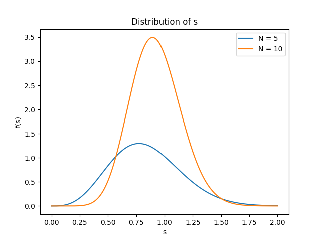
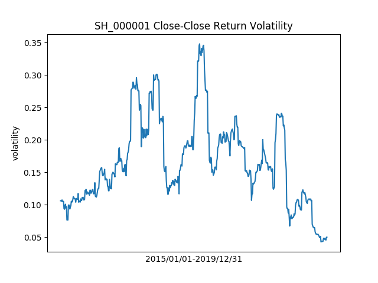
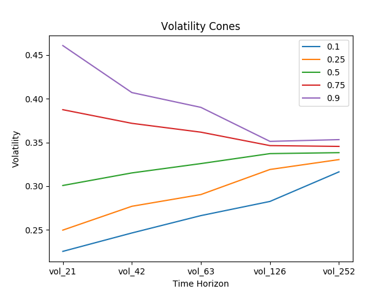

# Volatility Traindg by Euan Sinclair

- *Volatility Traindg* 读书笔记，交叉参照英文原版及机械工业出版社翻译版，译者王琦
- 使用Python3编程环境
- 阅读进度

  - [x] 第一章：期权定价
  - [x] 第二章：波动率的度量
  - [x] 第三章：收益率和波动率的典型事实
  - [x] 第四章：预测波动率
  - [ ] 第五章：隐含波动率的动态变化
  - [ ] 第六章：对冲
  - [ ] 第七章：对冲后的期权头寸的分布
  - [ ] 第八章：资金管理
  - [ ] 第九章：交易评估
  - [ ] 第十章：心理学
  - [ ] 第十一章：通过波动率交易来获利
  - [ ] 第十二章：VIX
  - [ ] 第十三章：杠杆ETF
  - [ ] 第十四章：一笔交易的生命周期
  - [ ] 第十五章：结论

- [Volatility Traindg by Euan Sinclair](#volatility-traindg-by-euan-sinclair)
  - [第一章 期权定价](#%e7%ac%ac%e4%b8%80%e7%ab%a0-%e6%9c%9f%e6%9d%83%e5%ae%9a%e4%bb%b7)
    - [Black-Scholes-Merton Model](#black-scholes-merton-model)
      - [期权的基本属性](#%e6%9c%9f%e6%9d%83%e7%9a%84%e5%9f%ba%e6%9c%ac%e5%b1%9e%e6%80%a7)
      - [BSM公式与期权的公允价值](#bsm%e5%85%ac%e5%bc%8f%e4%b8%8e%e6%9c%9f%e6%9d%83%e7%9a%84%e5%85%ac%e5%85%81%e4%bb%b7%e5%80%bc)
        - [Taylor Expansion](#taylor-expansion)
    - [模型假设](#%e6%a8%a1%e5%9e%8b%e5%81%87%e8%ae%be)
      - [标的合约可交易](#%e6%a0%87%e7%9a%84%e5%90%88%e7%ba%a6%e5%8f%af%e4%ba%a4%e6%98%93)
      - [标的不支付股息或储存费用](#%e6%a0%87%e7%9a%84%e4%b8%8d%e6%94%af%e4%bb%98%e8%82%a1%e6%81%af%e6%88%96%e5%82%a8%e5%ad%98%e8%b4%b9%e7%94%a8)
      - [标的可做空](#%e6%a0%87%e7%9a%84%e5%8f%af%e5%81%9a%e7%a9%ba)
      - [利率单一且不变](#%e5%88%a9%e7%8e%87%e5%8d%95%e4%b8%80%e4%b8%94%e4%b8%8d%e5%8f%98)
      - [不存在税收](#%e4%b8%8d%e5%ad%98%e5%9c%a8%e7%a8%8e%e6%94%b6)
      - [可以交易任何数量的合约标的，且交易不产生费用](#%e5%8f%af%e4%bb%a5%e4%ba%a4%e6%98%93%e4%bb%bb%e4%bd%95%e6%95%b0%e9%87%8f%e7%9a%84%e5%90%88%e7%ba%a6%e6%a0%87%e7%9a%84%e4%b8%94%e4%ba%a4%e6%98%93%e4%b8%8d%e4%ba%a7%e7%94%9f%e8%b4%b9%e7%94%a8)
      - [波动率为常数](#%e6%b3%a2%e5%8a%a8%e7%8e%87%e4%b8%ba%e5%b8%b8%e6%95%b0)
      - [收益率服从正态分布/价格服从对数正态分布](#%e6%94%b6%e7%9b%8a%e7%8e%87%e6%9c%8d%e4%bb%8e%e6%ad%a3%e6%80%81%e5%88%86%e5%b8%83%e4%bb%b7%e6%a0%bc%e6%9c%8d%e4%bb%8e%e5%af%b9%e6%95%b0%e6%ad%a3%e6%80%81%e5%88%86%e5%b8%83)
  - [第二章 波动率的度量](#%e7%ac%ac%e4%ba%8c%e7%ab%a0-%e6%b3%a2%e5%8a%a8%e7%8e%87%e7%9a%84%e5%ba%a6%e9%87%8f)
    - [波动率的定义](#%e6%b3%a2%e5%8a%a8%e7%8e%87%e7%9a%84%e5%ae%9a%e4%b9%89)
      - [除息除权导致的影响](#%e9%99%a4%e6%81%af%e9%99%a4%e6%9d%83%e5%af%bc%e8%87%b4%e7%9a%84%e5%bd%b1%e5%93%8d)
      - [Jensen's Inequality](#jensens-inequality)
      - [Close-to-Close Estimator](#close-to-close-estimator)
      - [Close-to-Close Estimator实证研究](#close-to-close-estimator%e5%ae%9e%e8%af%81%e7%a0%94%e7%a9%b6)
    - [其他波动率估计量](#%e5%85%b6%e4%bb%96%e6%b3%a2%e5%8a%a8%e7%8e%87%e4%bc%b0%e8%ae%a1%e9%87%8f)
      - [Parkinson Estimator](#parkinson-estimator)
      - [Garman-Klass Estimator](#garman-klass-estimator)
      - [Rogers-Satchell Estimator](#rogers-satchell-estimator)
      - [Yang-Zhang Estimator](#yang-zhang-estimator)
      - [First Exit Time Estimator （首次退出时间估计量）](#first-exit-time-estimator-%e9%a6%96%e6%ac%a1%e9%80%80%e5%87%ba%e6%97%b6%e9%97%b4%e4%bc%b0%e8%ae%a1%e9%87%8f)
      - [估计量总结](#%e4%bc%b0%e8%ae%a1%e9%87%8f%e6%80%bb%e7%bb%93)
    - [使用高频数据](#%e4%bd%bf%e7%94%a8%e9%ab%98%e9%a2%91%e6%95%b0%e6%8d%ae)
  - [第三章 收益率和波动率的典型事实](#%e7%ac%ac%e4%b8%89%e7%ab%a0-%e6%94%b6%e7%9b%8a%e7%8e%87%e5%92%8c%e6%b3%a2%e5%8a%a8%e7%8e%87%e7%9a%84%e5%85%b8%e5%9e%8b%e4%ba%8b%e5%ae%9e)
    - [典型事实列表](#%e5%85%b8%e5%9e%8b%e4%ba%8b%e5%ae%9e%e5%88%97%e8%a1%a8)
      - [波动率并非常数](#%e6%b3%a2%e5%8a%a8%e7%8e%87%e5%b9%b6%e9%9d%9e%e5%b8%b8%e6%95%b0)
      - [收益率分布](#%e6%94%b6%e7%9b%8a%e7%8e%87%e5%88%86%e5%b8%83)
      - [成交量和波动率](#%e6%88%90%e4%ba%a4%e9%87%8f%e5%92%8c%e6%b3%a2%e5%8a%a8%e7%8e%87)
      - [波动率分布](#%e6%b3%a2%e5%8a%a8%e7%8e%87%e5%88%86%e5%b8%83)
  - [第四章 预测波动率](#%e7%ac%ac%e5%9b%9b%e7%ab%a0-%e9%a2%84%e6%b5%8b%e6%b3%a2%e5%8a%a8%e7%8e%87)
    - [波动率是否可以被预测](#%e6%b3%a2%e5%8a%a8%e7%8e%87%e6%98%af%e5%90%a6%e5%8f%af%e4%bb%a5%e8%a2%ab%e9%a2%84%e6%b5%8b)
      - [无摩擦交易市场（交易费用为零）](#%e6%97%a0%e6%91%a9%e6%93%a6%e4%ba%a4%e6%98%93%e5%b8%82%e5%9c%ba%e4%ba%a4%e6%98%93%e8%b4%b9%e7%94%a8%e4%b8%ba%e9%9b%b6)
      - [信息有效（完美信息流）](#%e4%bf%a1%e6%81%af%e6%9c%89%e6%95%88%e5%ae%8c%e7%be%8e%e4%bf%a1%e6%81%af%e6%b5%81)
      - [理性人（对信息的价格影响力的共识）](#%e7%90%86%e6%80%a7%e4%ba%ba%e5%af%b9%e4%bf%a1%e6%81%af%e7%9a%84%e4%bb%b7%e6%a0%bc%e5%bd%b1%e5%93%8d%e5%8a%9b%e7%9a%84%e5%85%b1%e8%af%86)
    - [预测波动率](#%e9%a2%84%e6%b5%8b%e6%b3%a2%e5%8a%a8%e7%8e%87)
      - [EWMA（Exponentially Weighted Moving Average）](#ewmaexponentially-weighted-moving-average)
      - [GARCH（Generalized Auto-Regressive Conditional Heteroskedasticity）](#garchgeneralized-auto-regressive-conditional-heteroskedasticity)
      - [MLE（Maximum Likelihood Estimation）](#mlemaximum-likelihood-estimation)
        - [似然函数（Likelihood Function）](#%e4%bc%bc%e7%84%b6%e5%87%bd%e6%95%b0likelihood-function)
        - [最大似然估计（Maximum Likelihood Estimation）](#%e6%9c%80%e5%a4%a7%e4%bc%bc%e7%84%b6%e4%bc%b0%e8%ae%a1maximum-likelihood-estimation)
          - [例1：离散分布（以伯努利试验（Bernoulli trial）为例）](#%e4%be%8b1%e7%a6%bb%e6%95%a3%e5%88%86%e5%b8%83%e4%bb%a5%e4%bc%af%e5%8a%aa%e5%88%a9%e8%af%95%e9%aa%8cbernoulli-trial%e4%b8%ba%e4%be%8b)
          - [例2：连续分布（以高斯分布（Gaussian Distribution）为例）](#%e4%be%8b2%e8%bf%9e%e7%bb%ad%e5%88%86%e5%b8%83%e4%bb%a5%e9%ab%98%e6%96%af%e5%88%86%e5%b8%83gaussian-distribution%e4%b8%ba%e4%be%8b)
      - [波动率锥](#%e6%b3%a2%e5%8a%a8%e7%8e%87%e9%94%a5)
      - [使用基本面信息来预测波动率](#%e4%bd%bf%e7%94%a8%e5%9f%ba%e6%9c%ac%e9%9d%a2%e4%bf%a1%e6%81%af%e6%9d%a5%e9%a2%84%e6%b5%8b%e6%b3%a2%e5%8a%a8%e7%8e%87)
    - [方差溢价](#%e6%96%b9%e5%b7%ae%e6%ba%a2%e4%bb%b7)

## 第一章 期权定价

*勘误：*

- 英文原版第一版中组合价值变化公式最后一项符号为$+$，在第二版中调整为$-$，应以第二版为准。

### Black-Scholes-Merton Model

首先构建的是一个delta对冲的组合。*英文原版中描述为‘delta-hedged portfolio’, 翻译版中使用的词汇是“delta中性”，delta-hedged和delta-neutral是否有细微区别此处存疑。*

#### 期权的基本属性

在讨论具体的计算之前，可以首先定义出期权的一些基本属性。

- 当合约标的上涨（下跌）时，call(put) option变得更有价值，因为此时期权成为实值的可能性提高。(delta/gamma）
- 期权的价值永远不会比合约标的的价格（即行权价格）更高。
- 随着时间的流逝，期权价值将下降，因为期权变为实值的时间减少了。（theta）
- 期权价值与不确定性正相关，不确定性越强，期权价值越高。（volatility）
- 利率上升，期权价值下降，因为提高了融资购买期权的成本。（rho）
- 股息的发放提升put option value，降低call option value，因为股息的发放会降低标的价格。

#### BSM公式与期权的公允价值

对于一个delta对冲的组合，由一份long call option和$\Delta$份 short stock构成，其价值为：

$$
C(S_t)-\Delta S_t
$$

在t+1的时刻，投资组合的价值变化由期权和股票头寸的价值变化，以及为了构建这个组合而产生的融资成本构成。因此，在t+1时刻，组合的价值变化为：

$$
(C(S_{t+1})-\Delta S_{t+1})-(C(S_t)-\Delta S_t)-r(C(S_t)-\Delta S_t)\\
=(C(S_{t+1})-C(S_t))-(\Delta S_{t+1}-\Delta S_t)-r(C(S_t)-\Delta S_t)
$$

最后一项是加入了融资成本的考量。买入option产生了负的现金流而卖出stock产生了正的现金流，因此对于组合的持有者来说，这一部分产生了$r(C(S_t)-\Delta S_t)$的成本。**由于间隔时间非常短，因此在接下来的推导中假设delta在t到t+1的时间变化内不发生改变。**

Underlying price对option value的影响，在这里使用Taylor Expansion近似，同时，在其他条件不变时，时间会对期权价格产生影响，这部分的影响直接用$\theta$表示。

##### Taylor Expansion

> 怎样更好地理解并记忆泰勒展开式？[知乎](https://www.zhihu.com/question/25627482/answer/313088784)

泰勒展开使用多项式对复杂函数进行近似，即保证初始值一致、初始值处导数相同，二阶导数相同……在此思想上，选择原函数$f(x)$上的一点$0, f(0)$，设近似曲线的解析式为$g(x)$，则$g(x)$为一个n阶多项式，其形式为：

$$
g(x)=a_0+a_1x+a_2x^2+\dots+a_nx^n
$$

由于初始点相同，即保证$f(0)=g(0)=a_0$，由于n阶导数相同，即保证$f^n(0)=g^n(0)$，对于多项式$g(x)$，其n阶导数为$n!a_n$，因此求出$a_n=\frac{f^n(0)}{n!}$，故：

$$
g(x)=g(0)+\frac{f^1(0)}{1!}x+\frac{f^2(0)}{2!}x^2+\dots+\frac{f^n(0)}{n!}x^n
$$

在此基础上，将初始点从0推广至任意$x_0$即可得到：

$$
f(x)\approx g(x)=f(x_0)+\frac{f^1(x_0)}{1!}(x-x_0)+\frac{f^2(x_0)}{2!}(x-x_0)^2+\dots+\frac{f^n(x_0)}{n!}(x-x_0)^n
$$

注意此处的约等于，只要n不是正无穷，则约等号必须保留，换句话说，泰勒公式可以写成：

$$
f(x)=g(x)=\sum_{n=0}^{+\infty}\frac{f^n(x_0)}{n!}(x-x_0)^n
$$

在此基础上，组合的价值推导如下，初始点选择为$S_t$：

$$
C(S_{t+1})\approx  C(S_t)+\frac{\partial C(S_t)}{\partial S_t}(S_{t+1}-S_t)+\frac{1}{2}\frac{\partial^2C(S_t)}{\partial S_t^2}(S_{t+1}-S_t)^2+\theta
$$

此外还有上文所说时间对期权价格的影响$\theta$。在这里，underlying price对option value的影响使用的二阶导数，而时间对期权价格的影响仅使用了一阶导数。在第一章中，作者认为合约标的的价格变化是随机的，因此这是一种**风险（risk）**，而时间的流逝是可预期的，因此这是一种**成本（cost）**，

因此可以推出公式：

$$
C(S_t)+\frac{\partial C(S_t)}{\partial S_t}(S_{t+1}-S_t)+\frac{1}{2}\frac{\partial^2C(S_t)}{\partial S_t^2}(S_{t+1}-S_t)^2+\theta-C(S_t)-\Delta(S_{t+1}-S_t)-r(C(S_t)-\Delta S_t)\\
=\frac{1}{2}(S_{t+1}-S_t)^2\Gamma+\theta-r(C(S_t)-\Delta S_t)
$$

（显然，$\frac{\partial C(S_t)}{\partial S_t}=\Delta,\frac{\partial^2C(S_t)}{\partial S_t^2}=\Gamma$）

因此，以上公式给出了当股票价格发生微小变化时，组合持有者所获得的利润。它由三部分组成：

1. gamma效应。由于gamma为正，因此期权多头可以盈利，利润大致相当于股票价格变化的平方的一半。
2. theta效应。由于theta为负，随着时间的流逝，期权多头会损失价值。
3. 融资影响。

从平均上说：

$$
(S_{t+1}-S_t)^2\cong\sigma^2S^2
$$

其中$\sigma$即underlying returns的standard derivation，也就是波动率volatility。因此，可以将公式改写为：

$$
\frac{1}{2}\sigma^2S^2\Gamma+\theta-r(C(S_t)-\Delta S_t)
$$

假定组合无风险，则组合不能产生任何非正常收益，即收益为0，因此，期权的公允价格应该满足等式：

$$
\frac{1}{2}\sigma^2S^2\Gamma+\theta-r(C(S_t)-\Delta S_t)=0
$$

在这个推导过程中，有三个隐含假设，即：

- 有可交易的标的且允许卖空存在，同时能以任何交易量交易且不产生任何费用
- 融资成本和投资成本相同且保持不变，均为r
- 标的价格变化连续且平滑，否则则出现不可导的点。这是一个强假设，在现实生活中，资产价格的连续性假设并不成立，因此方向依赖（directional dependence）现象会出现。

在上式中，资产的价格变化没有体现，但是资产价格变化的平方通过波动率项反映在公式中。因此，一个持有delta对冲组合的交易员能否获利的关键就在于合约标的价格的变化幅度。无论资产收益率是否服从正态分布，只要资产收益率有一个有限的方差，这个结论就会成立。

一旦期权和标的合约都在市场上进行公开交易，那么收益将与隐含波动率和已实现波动率的差成比例，即收益部分在于：

$$
\frac{1}{2}(\sigma_{real}^2-\sigma_{implied}^2)S^2\Gamma
$$

又因为vega体现了期权价值对合约标的价格波动率的敏感程度，即隐含波动率每变化一个百分点，期权价值相应的变化，因此，收益也可以表示为：

$$
vega(\sigma_{real}-\sigma_{implied})
$$

以上两式可以得到gamma和vega之间的关系为$vega=\sigma TS^2\Gamma$，但是这个关系对于交易并没有太大的帮助。

书中不加证明的给出了vega和gamma之间的关系，找到的相关reference：

> VegaGammaRelationship [fabiomercurio](http://www.fabiomercurio.it/VegaGammaRelationship.pdf)

关于波动率变化带来的收益$vega(\sigma_{real}-\sigma_{implied})$，也可以用以下推导得出：

假设现在持有一份根据隐含波动率$\sigma_{implied}^2$进行初始定价的看涨期权$C(\sigma_{implied}^2)$，当波动率由$\sigma_{implied}^2$变化至$\sigma^2$时，期权价格变化，产生了收益。定义$\delta=\sigma^2-\sigma_{implied}^2$，可以得知新期权的价格：

$$
C(\sigma^2)=C(\sigma_{implied}^2+\delta)=C(\sigma_{implied}^2)+\delta\frac{\partial C}{\partial(\sigma^2)}
$$

$\delta$是一个增加量，那么加上$\delta$后的call value相当于在原call value的基础上加上$\delta$倍方差的一阶导。

最后一项中：

$$
\frac{\partial C}{\partial(\sigma^2)}=\frac{\partial C}{\partial\sigma}\frac{\partial\sigma}{\partial(\sigma^2)}=vega\times\frac{1}{2\sigma}
$$

因此，损益项（PNL）$\delta\frac{\partial C}{\partial(\sigma^2)}$可以变为：

$$
\delta\times vega\times\frac{1}{2\sigma}=(\sigma^2-\sigma_{implied}^2)\times vega\times\frac{1}{2\sigma}\\
=\frac{\sigma+\sigma_{impllied}}{2\sigma}\times vega\times(\sigma-\sigma_{impllied})\\
\approx vega(\sigma-\sigma_{impllied})
$$

在假定波动率变化很小的条件下，最后一个约等于成立。根据这个公式，可以简化地认为，损益与波动率成线性关系。

### 模型假设

在这样一个简化的模型中，模型使用者需要对模型采用的假设有比较明确的认识，这样才能在实际应用中理解模型的利弊和适用范围。

#### 标的合约可交易

尽管大部分时候人们关注的是股票和期货标的，这些标的通常是有很好的流动性的，但是对于新建立的标的或者标的流动性出现匮乏的时候，这个模型的适用性就会大大降低。

#### 标的不支付股息或储存费用

一旦支付股息$q$，则无风险利率$r$就应该用$r-q$来替代，同样，如果产生仓储费用$q^*$，则利率应该用$r+q^*$替换。

#### 标的可做空

对于期货来说没有问题，但是面对股票则不一定可行。即使可以做空股票，那么一般也需要支付一定的费用来借入股票。这部分费用可以通过假设一个虚拟的股息来实现。

#### 利率单一且不变

利率是存在bid-ask spread的，同时利率本身也会有波动。但是相比其他风险，利率变化带来的rho是不显著的。

#### 不存在税收

一旦发生支付股息的情况，则通常需要考虑税收问题。交易员需要记住应基于期权对其自身的价值来对期权定价，而不是考虑期权对投资者所产生的价值。

#### 可以交易任何数量的合约标的，且交易不产生费用

交易量不可能超过市场容量，同时交易股数也不可能拆分至无限小。因此，当手续费、清算费或买卖价差导致小额交易或连续对冲不经济时，模型需要修正。

#### 波动率为常数

在推导中，假设了波动率是一个常数，而不是一个关于时间或标的价格的函数，但是这并不符合实际。相反，还会有积极交易波动率这些变化的交易行为。

#### 收益率服从正态分布/价格服从对数正态分布

根据实证研究，这种假设是不成立的，而且会产生波动率微笑，它表面隐含波动率是行权价的函数。因此，需要有额外的方法对隐含的偏度和峰度进行度量。
此外还假设了标的价格的变化是连续的，然而，大幅跳空是常见的现象。这些价格跳跃是无法对冲的，复制策略也会彻底失效。因此需要学会使用其他期权来对冲这部分风险。

## 第二章 波动率的度量

*勘误：*

- 原版书和翻译版在给出Rogers-Satchell估计量时，对于$o_i$的解释均错误。查阅原始文献后，可以知道$o_i$为交易周期内的开盘价，而非书中所说的收盘价。
- 在说明Yang-Zhang估计量的本质时，原版书描述为close-to-open波动率和open-to-close波动率，翻译版表述为收盘-收盘估计量和开盘-收盘估计量，实际上根据公式应该是close-to-close和open-to-open。
- 翻译版在高频数据选择的部分，错误翻译了"13 half-hour periods"，原意因为13个半小时交易区间（因为美国交易时间为6.5小时每天）。

*Chapter2中有大量未加证明直接给出的公式和结论，由于推导过程不影响整体结论的理解，因此看书时部分推导也进行了省略。*

### 波动率的定义

波动率是方差的平方根，因此先讨论方差的标准定义，即：

$$
\sigma^2=\frac{1}{N}\sum^{N}_{i=1}(x_i-\bar{x})^2
$$

注意在此处，$x_i$是**对数收益率**，$\bar{x}$是**平均（对数）收益率**，$N$为**样本数量**。一般来说得到的数据需要进行年化处理。注意书上在此处写的容易引起误解，公式中的N是样本的数量，如果样本有10000个数据（每日的对数收益率），则N=10000，但是由于数据是日频，因此年化需要再乘以252。书中样本数量和年化因子都用N表示，不注意容易产生理解错误。

#### 除息除权导致的影响

一旦发生除息或者除权的情况，股价会有明显的变化，因此需要调整历史股价以保持数据的一致性，本质即统一数据口径。即所谓的复权。书中给出的方法为后复权，实务中常用前复权。

前复权即就是保持现有价位不变，将以前的价格缩减，将除权前的K线向下平移，使图形吻合，保持股价走势的连续性。后复权即就是将某股票上市以来累计涨幅，包括全部配股、送转股、分红，一直持有到目前的价位。简单理解就是前复权是将历史价位统一到现在标准，后复权是将现在价位还原到历史标准。

方差的计算是不基于任何分布假设的（显而易见），但是在对期权进行定价时，需要假设股票收益率服从一定的分布。在BSM模型中，收益率是服从对数正态分布的，因此，**当给定均值方差后，整个收益率分布的形状就得到了确定，而方差则完全刻画了收益率分布的宽度**。尽管在现实中这属于强假设，但是在建立模型中，人们还是希望方差（及波动率）成为刻画收益率分布宽度方面的重要甚至决定性参数。同时，由于估计收益率均值（即漂移项drift）是很难做到准确的，且收益率均值又和方差无法彻底割裂开进行分析，所以比较简单的处理方法就是将收益率均值$\bar{x}$设置为0，从而消灭一个噪音来源来增强对方差建模的准确性。

同时，通过样本方差估计整体方差需要考虑估计值的无偏性，因此修正后的样本方差应为：

$$
s^2=\frac{1}{N-1}\sum^{N}_{i=1}(x_i)^2
$$

特别需要注意的是：==尽管方差的估计是无偏的，但是直接在方差上进行开根得到的波动率是偏低的。== 这是由于Jensen's Inequality所导致。

**书中给出了另一个说明，这段说明有些奇怪，但是却影响后面公式的推导，因此标注在这里。**

**样本的方差如果是由$s^2=\frac{1}{N}\sum^{N}_{i=1}(x_i)^2$给出，那么总体方差应该在此基础上进行修正，结果为$\sigma^2=\frac{N}{N-1}s^2$。原文表述为 "Unfortunately, some authorities choose to avoid this step by directly defining the sample variance to be $s^2=\frac{1}{N-1}\sum^{N}_{i=1}(x_i)^2$"**

**个人理解，作者想表达的是，当使用样本方差估计总体方差时，应该计算出样本的总体方差后，将样本的总体方差调大，作为整体方差，但是很多人为了避免这一步，直接使用了修正的样本方差作为总体方差的无偏估计量。**

#### Jensen's Inequality

Convex Function定义为：在$\mathbb{R}^\mathbb{N}\rightarrow \mathbb{R}$上：

$$
f(\theta x+(1-\theta)y)\leq\theta f(x)+(1-\theta)f(y) \qquad \theta \in [0,1]
$$

将变量推广至多个后可以得出：

$$
f(\theta_1x_1+\theta_2x_2+\dots+\theta_nx_n)\leq\theta_1f(x_1)+\theta_2f(x_x)+\dots+\theta_nf(x_n) \\
\Rightarrow f(\sum_{i=1}^{n}\theta_ix_i)\leq\sum_{i=1}^{n}\theta_if(x_i) \qquad \sum_{i=1}^{n}\theta_i=1,  \forall\theta_i\geq0
$$

将变量进一步推广至连续条件下，如果有定义在凸函数$f(x)$的子集$\mathbb{S}$上的函数$p(x)$，那么可以得出以下不等式：

$$
f(\int_\mathbb{S}p(x)xdx)\leq\int_\mathbb{S}p(x)f(x)dx  \qquad \int_\mathbb{S}p(x)dx=1, p(x_i)\geq0
$$

如果$x$是随机变量而$p(x)$是$x$对应的概率密度函数，那么上式可以写成：

$$
f(\mathbb{E}(x))\leq \mathbb{E}(f(x))
$$

即Jensen's Inequality。在离散条件下，$\theta_i$为$x_i$发生的概率，Jensen's Inequality同样成立。

由于$f(x)=\sqrt{x}$是concave，因此结论相反$\mathbb{E}(f(x))\leq f(\mathbb{E}(x))$，所以：

$$
\mathbb{E}(s)=\mathbb{E}(\sqrt{s^2})<\sqrt{\mathbb{E}(s^2)}=\sqrt{\sigma^2}=\sigma
$$

所以，在此基础上得到的波动率偏低，需要进行修正。

假定（对数）收益率服从正态分布，那么样本标准差的分布函数就可以看成样本容量的函数，该函数表达式为：

$$
f_N(s)=2\frac{(\frac{N}{2\sigma^2})^{\frac{N-1}{2}}}{\Gamma(\frac{N-1}{2})}\exp({\frac{-Ns^2}{2\sigma^2}})s^{N-2}
$$

（此处未推导）

其中$s$是样本标准差，$\sigma$是总体标准差，$\Gamma(x)$是Gamma函数，定义为$\Gamma(n)=(n-1)!$，可以画出$f_N(s)$关于$s, N$的图像。

```Python
import numpy as np
import matplotlib.pyplot as plt

s = np.linspace(0, 2, 10000)


def s_distribution(s, N, sigma=1):
    y = 2 * ((N / 2 * sigma**2)**(
        (N - 1) / 2) / np.math.factorial(int((N - 1) / 2) - 1)) * np.exp(-N * s**2 / 2 * sigma**2) * s**(N - 2)
    # factorial阶乘函数参数只能为integer，在此处(n-1) / 2返回的不是浮点数而是取整后的值，因此不会报错
    return y


plt.title('Distribution of s')
plt.xlabel('s')
plt.ylabel('f(s)')
plt.plot(s, s_distribution(s, 5), label='N = 5')
plt.plot(s, s_distribution(s, 10), label='N = 10')
plt.legend()
plt.show()
# plt.savefig("s_distribution.png")
```



显然，随着样本容量N的增大，样本标准差趋向于总体标准差。而总体标准差和样本标准差的偏差程度可以由下式精确给出：

$$
\bar{s}=b(N)\sigma \\
b(N)=\sqrt{\frac{2}{N}}\frac{\Gamma(\frac{N}{2})}{\Gamma(\frac{N-1}{2})}
$$

（此处未推导）

这个公式中给出的样本标准差$\bar{s}$就是总体标准差$\sigma$的无偏估计量。随着样本容量N的增大，b(N)无限趋近于1。但是，这个公式给出的估计量收敛至真实值的速率较慢，因此技术上称为**非有效估计量 (inefficient estimator)**。

这个估计量的方差（即样本方差的方差）可以给出：

$$
var(s)=\mathbb{E}(s-\mathbb{E}(s))^2 \\
=\mathbb{E}(s^2-2s\mathbb{E}(s)+\mathbb{E}(s)^2) \\
=\mathbb{E}(s^2)-2\mathbb{E}(s)\mathbb{E}(s)+\mathbb{E}(s)^2=\mathbb{E}(s^2)-\mathbb{E}(s)^2\\
\Rightarrow var(s)=s^2-(\bar{s})^2\\
=\frac{N-1}{N}\sigma^2-b(N)^2\sigma^2\\
=\frac{1}{N}(N-1-2\frac{\Gamma^2(\frac{N}{2})}{\Gamma^2(\frac{N-1}{2})})\sigma^2
$$

*此处推导需结合前文提及的样本方差的计算一起理解，否则倒数第二行的第一项系数将和书中给出的系数互为倒数，导致无法推出后续的结论。*

随着样本容量的增加，样本方差的方差会逐渐向总体方差收敛。

由于上式难以直接计算，因此使用一些近似变换以得到一个较为简单直接的结论。首先，给定如下公式：

$$
\frac{\Gamma(k+\frac{1}{2})}{\Gamma(k)}=\sqrt{k}(1-\frac{1}{8k}+\frac{1}{128k^2}+\dots)
$$

因此可以将$b(N)^2$化简为：

$$
b(N)^2=\frac{2}{N}(\frac{\Gamma(\frac{N-1}{2}+\frac{1}{2})}{\Gamma(\frac{N-1}{2})})^2 \\
\approx\frac{2}{N}\frac{N-1}{2}(1-\frac{1}{4(N-1)})^2 \\
=\frac{N-1}{N}\frac{16(N-1)^2-8(N-1)+1}{16(N-1)^2} \\
\approx\frac{16(N-1)^2-8(N-1)}{16N(N-1)} \\
=\frac{2N-3}{2N}=1-\frac{3}{2N}
$$

再将$b(N)^2$的近似值代回$var(s)$可得：

$$
var(s)\approx(\frac{N-1}{N}-\frac{2N-3}{2N})\sigma^2=\frac{\sigma^2}{2N}
$$

用这个方法得到的波动率的近似标准差和波动率的真实标准差是非常接近的。

#### Close-to-Close Estimator

使用收盘价-收盘价对波动率进行估计是非常有效而实用的，因为这种方法对波动率的估计可以改写为另一种简单的形式，从而将股价的平均变动和波动率联系起来。

*书中在接下来的内容直接给出了公式和结论，没有给出任何相关的推导和证明，作者所表达的想法困扰我很久。在查阅大量资料后发现网上几乎没有与之相关的信息，最后在quant.stackexchange.com上找到了针对这个有同样困惑的人提出的问题，该问题下仅有的一个回答提供了思考的方向，从而给出完整的证明如下。*

> Daily Return to Approximate Annualized Realized Volatility 16 or 20? [stackexchange](https://quant.stackexchange.com/questions/35804/daily-return-to-approximate-annualized-realized-volatility-16-or-20)
>
> The expectation of the half-normal distribution [stackexchange](https://math.stackexchange.com/questions/67561/the-expectation-of-the-half-normal-distribution)

书中直接给出绝对收益率的均值为：

$$
\mathbb{E}(|R_t|)=\sqrt{\frac{2}{\pi}}\sigma
$$

显然，此处每日收益率（daily return） $R_t=X\sim N(0,\sigma^2)$ is a random variable follow a normal distribution with mean 0 and variance $\sigma^2$。显然，$Y=|X|$服从一个半正态分布（half normal distribution）。因此，收益率的绝对值的期望$\mathbb{E}(|R_t|)$可以求解如下：

$$
\mathbb{E}(|X|)=\int_{-\infty}^{\infty}|x|f(x)dx=2\int_{0}^{\infty}xf(x)dx
$$

$f(x)$ is the probability density function of $x$：

$$
\int_{0}^{\infty}xf(x)dx=\int_{0}^{\infty}x\frac{1}{\sqrt{2\pi}\sigma}e^{-\frac{x^2}{2\sigma^2}}dx\\
=\frac{1}{\sqrt{2\pi}\sigma}\int_{0}^{\infty}xe^{-\frac{x^2}{2\sigma^2}}dx\\
=\frac{1}{\sqrt{2\pi}\sigma}\int_{0}^{\infty}-\sigma^2e^{-\frac{x^2}{2\sigma^2}}d(-\frac{x^2}{2\sigma^2})\\
=-\frac{\sigma}{\sqrt{2\pi}}\int_{0}^{-\infty}e^udu
$$

where

$$
\int_{0}^{-\infty}e^udu=|_{0}^{-\infty}e^u=0-1=-1
$$

thus

$$
\int_{0}^{\infty}xf(x)dx=\frac{\sigma}{\sqrt{2\pi}}\\
\Rightarrow \mathbb{E}(|X|)=\frac{2\sigma}{\sqrt{2\pi}}=\sqrt{\frac{2}{\pi}}\sigma
$$

这个的证明也可以通过Gamma函数及Gamma分布的性质得到，参考：

> 正态分布下含绝对值的期望求解 [CSDN](https://blog.csdn.net/u011240016/article/details/53214966?utm_source=blogxgwz2)
>
> 伽马函数的总结 [CSDN](https://blog.csdn.net/u011240016/article/details/53032173?locationNum=1&fps=1)

当有$\mathbb{E}(|R_t|)=\sqrt{\frac{2}{\pi}}\sigma$后，可以得出$\sigma=\sqrt{\frac{\pi}{2}}\mathbb{E}(|R_t|)$。

对于样本$R_t$，每日波动率的估计值$\hat{\sigma}$为：

$$
\hat{\sigma}=\sqrt{\frac{\pi}{2}}\frac{1}{N}\sum_{t=1}^{N}|R_t|
$$

N为每天绝对收益率的样本数量。然后对每日波动率的估计值$\hat{\sigma}$进行年化，假设一年有252个交易日且每天的收益率是独立同分布（i.i.d）的，则

$$
\sigma_{annual}=\hat{\sigma}\sqrt{T}=19.896(\frac{1}{N}\sum_{t=1}^{N}|R_t|)
$$

因此，年化波动率约等于为每日收益率\*20。

如果假设平均收益为0的话，每日的波动率可以近似为每日收益率，那么年化波动率约等于每日收益率\*16，即

$$
\sigma_{annual}=\sigma_{daily}\sqrt{T}=\sqrt{252}\sigma_{daily}\approx16\sigma_{daily}
$$

对此，书中指出：“Traders ofter think that 16% annualized volatility corresponds to a daily return of 1%. But this is due to confusing the square root of average squared returns with the daily return.”即16%的年化波动率并不代表1%的日收益率。

作者认为，收益率的标准差并不代表每日收益率。而当样本数量N足够大时，这两种计算方法产生的误差应该是非常小的。

**需要注意的是，并不是说书中给出的close-to-close方法计算的年化波动率就一定大于传统方法计算出的年化波动率。** 这两种方法本质上采用的思路是不一样的，前者以对数收益率的绝对值的均值为基础，后者以对数收益率的样本标准差为基础，这两者是有区别的。

#### Close-to-Close Estimator实证研究

使用`tushare`库给出的财经数据，对两种方法下21天（1个月），42天（2个月）和63天（3个月）的年化波动率进行计算和比较：

```Python
import numpy as np
import pandas as pd
from datetime import date
import tushare as ts
today = date.today().strftime("%Y-%m-%d")
print(today)

# 使用000001平安银行数据进行测试，获取历史开盘价/收盘价
df = ts.get_hist_data('000001')[['open', 'close']]
# 计算对数收益率
df['log_return'] = np.log(df['close'] / df['close'].shift(-1))

# close-to-close传统方法，年化波动率为每日收益率波动率的倍数
# traditional_std_vol = 15.875*daily_return的std
df['traditional_std_vol_21'] = df['log_return'].rolling(21).std().shift(-20) * np.sqrt(252)
df['traditional_std_vol_42'] = df['log_return'].rolling(42).std().shift(-41) * np.sqrt(252)
df['traditional_std_vol_63'] = df['log_return'].rolling(63).std().shift(-62) * np.sqrt(252)

# close-to-close书中方法，年化波动率为每日绝对收益率均值的倍数
# absolute_mean_vol = 19.896*absolute(daily_return)的mean
df['absolute_mean_vol_21'] = abs(df['log_return']).rolling(21).mean().shift(-20) * np.sqrt(np.pi / 2 * 252)
df['absolute_mean_vol_42'] = abs(df['log_return']).rolling(42).mean().shift(-41) * np.sqrt(np.pi / 2 * 252)
df['absolute_mean_vol_63'] = abs(df['log_return']).rolling(63).mean().shift(-62) * np.sqrt(np.pi / 2 * 252)

df.dropna(axis=0, how='any', inplace=True)
```

需要注意的是，尽管肉眼观察感觉两者差距不大，但是如果对两种结果进行paired-sample t-test，可以发现实际上两者均值统计上显著不相等，traditional_std_vol在均值上略高于absolute_mean_vol。这也印证了上文中所说由Jensen's Inequality导致的偏差，因为本质上traditional_std_vol是对收益率的平方差求均值（得到方差）后开方得到波动率。

```Python
from scipy import stats
print(stats.ttest_rel(df['traditional_std_vol_21'], df['absolute_mean_vol_21']))
print(stats.ttest_rel(df['traditional_std_vol_42'], df['absolute_mean_vol_42']))
print(stats.ttest_rel(df['traditional_std_vol_63'], df['absolute_mean_vol_63']))
```

> Ttest_relResult(statistic=15.75505677750894, pvalue=2.256558863417449e-46)
> Ttest_relResult(statistic=19.96400906937235, pvalue=5.434372422203862e-67)
> Ttest_relResult(statistic=21.56658259853215, pvalue=4.401371109149757e-75)

另一个需要注意的点是：Jensen's Inequality 并不说明传统计算方法和绝对收益率方法计算出波动率的必然的大小关系，而是说明了平方收益率计算方法和传统计算方法计算出的波动率之间的大小关系。

### 其他波动率估计量

使用close-to-close（收盘价-收盘价）估计波动率是简单而直观的，但是只使用了每天的收盘价和前一天的收盘价进行收益率的计算，因此，这样的方法计算出的波动率收敛至真实波动率的速度比较慢。同时，由于使用的数据只有收盘价，因此对已有的数据信息不能做到充分的利用。在此基础上，给出了一些新的volatility estimator。

#### Parkinson Estimator

Parkinson volatility estimator：

$$
\hat{\sigma}=\sqrt{\frac{1}{4N\ln2}\sum_{i=1}^{N}(\ln\frac{h_i}{l_i})^2}
$$

其中$h_i$是交易时的最高价，$l_i$是交易时的最低价。同样，如果要得到年化值，也需在估计量上乘以每年交易周期数的平方根。这个估计值由于在每个交易时段都使用了两个价格，而不像close-to-close一样只用了一个，因此，这个估计量收敛至真实估计量的速度会远大于close-to-close估计量。

如果价格是连续的，那么Parkinson估计量就会是方差的无偏估计。然而，由于市场仅能以离散的交易单位进行交易，因此价格样本是离散的，同时，由于市场只在每天的一定时间开放，因此，在交易时间之外的，没有被观察到的真实值，就不能成为估计时使用的最高值和最低值。所以，基于能观察到的极差构造的估计量，会系统性地低估波动率。

由于Parkinson估计量以最高价和最低价计算波动率，很多人会错误的认为由于交易很少以最高价或最低价执行，因此Parkinson估计量会高估波动率。这个理解的错误之处在于：尽管交易中确实很少以极端价格成交，但是这与波动率是否被高估或是低估无关。Parkinson估计量并没有体现交易的执行情况，**只是说明波动率和极差是相关的**。换而言之，Parkinson估计量是对波动率的估计而非对交易的估计。

由于波动率和极差相关是符合直觉的。因此这种想法也可以扩展到其他不是最高价-最低价的极差。

#### Garman-Klass Estimator

Garman和Klass在Parkinson估计量的基础上，加上了对收盘价的调整，表达式为：

$$
\hat{\sigma}=\sqrt{\frac{1}{N}\sum_{i=1}^{N}\frac{1}{2}(\ln\frac{h_i}{l_i})^2-\frac{1}{N}\sum_{i=1}^{N}(2\ln2-1)(\ln\frac{c_i}{c_{i-1}})^2}
$$

这里$c_i$为交易周期内的收盘价。

这个估计量同样有很高的收敛效率。但是同样由于离散取样的原因，这个方法同样会系统性低估实际波动率。

#### Rogers-Satchell Estimator

前述几种估计量中，都隐含着价格服从无漂移项几何布朗运动（"underlying follows a drift-less geometric Brownian motion (GBM)"）及市场连续交易的假设。Rogers, Satchell和Yoon放宽了类似的限制，引入了带有漂移项的更优的估计量，表达式为：

$$
\hat{\sigma}=\sqrt{\frac{1}{N}\sum_{i=1}^{N}((\ln\frac{h_i}{c_i})(\ln\frac{h_i}{o_i})+(\ln\frac{l_i}{c_i})(\ln\frac{l_i}{o_i}))}
$$

这里$o_i$为交易周期内的开盘价。

#### Yang-Zhang Estimator

Yang和Zhang推导出了适用于开盘价格跳空的估计量，其本质是Rogers-Satchell-Yoon估计量，close-to-close估计量和open-to-open估计量的加权平均。表达式为：

$$
\hat{\sigma}=\sqrt{\sigma_o^2+k\sigma_c^2+(1-k)\sigma_{rs}^2}
$$

其中

$$
\sigma_o^2=\frac{1}{N-1}\sum_{i=1}^{N}[\ln(\frac{o_i}{o_{i-1}})-\frac{1}{N}\sum_{i=1}^{N}\ln(\frac{o_i}{o_{i-1}})]^2 \\
\sigma_c^2=\frac{1}{N-1}\sum_{i=1}^{N}[\ln(\frac{c_i}{c_{i-1}})-\frac{1}{N}\sum_{i=1}^{N}\ln(\frac{c_i}{c_{i-1}})]^2 \\
\sigma_{rs}^2=\frac{1}{N}\sum_{i=1}^{N}((\ln\frac{h_i}{c_i})(\ln\frac{h_i}{o_i})+(\ln\frac{l_i}{c_i})(\ln\frac{l_i}{o_i})) \\
k=\frac{0.34}{1.34+\frac{N+1}{N-1}}
$$

实际上，这5中估计量都存在向下偏差。同时，尽管后一种可以看做前一种的补充和更迭，但是在实际环境下，不同估计量的差别并不显著，同时整体的相关性也比较高。

#### First Exit Time Estimator （首次退出时间估计量）

前五种估计量是选定一个时间段，然后观察其中的特殊价格比如开盘价，收盘价，最高价，最低价等，从而估计波动率，这种思路下，考虑的是“价格会移动多远”。换个角度看，波动率也可以用“价格会移动多快”来思考。

在这个思路指导下，通过构造一个双边障碍来定义一个对数价格区间，分别是初始价格上涨/下跌$\Delta$。当触及障碍，则记录一个退出时间$\tau$，然后根据当前的实时价格重置一个障碍区间。这样，就可以得到一个退出时间构成的序列$(\tau_1,\tau_2,\dots,\tau_n)$，然后使用这个序列来估计波动率。

忽略推导过程，可以得出波动率的估计值为：

$$
\hat{\sigma}=\frac{\Delta}{\sqrt{\mathbb{E}(\tau)}}
$$

由于$E(\tau)$在样本N较小的情况下会产生偏差，因此对这个结果进行无偏修正，修正后的真实整体波动率为：

$$
\mathbb{E}[f(\bar{\tau})]=\hat{\sigma}=\sigma_{real}(1+\frac{1}{4N})
$$

也就是说，当样本只有一个时，需要对观测的波动率乘以4/5来修正，但是随着N的上升，估计值会迅速向真实值收敛。

#### 估计量总结

没有最好的估计量，所有的度量方法都包含了一定有效的信息。选取估计量时应该考虑估计量的实际意义而非仅局限于数学推论。书中给出了一个非常好的例子：如果Parkinson波动率为40%，而close-to-close波动率为20%，那么可以合理认为，真实波动来源于日内大幅波动，而收盘价则低估了真实的波动过程。这个认识会在决定如何进行更好的对冲时非常有用。

### 使用高频数据

使用高频数据可以改善估计质量，但是过于高频的数据则会将短期噪音引入估计，反而降低了估计的准确性。此外，在使用高频数据时，应当考虑到周期性带来的影响。一个为在有连续交易时，由于波动率主要由交易量驱动，当有夜间交易时，隔夜的波动率显然不能与日内交易的波动率同等看待。
另一个情况是真实波动率在一天内也会出现周期性，一般来说为开盘和收盘时的波动率最高，而盘中波动率较低。对于期权交易者，主要关注的是长期平均波动率，在较长的时间周期上，这些快速的日内波动会被平均掉，但是在高频数据中，路径依赖效应是波动率预测误差的主要来源。

## 第三章 收益率和波动率的典型事实

*勘误：*

- 中文版翻译杠杆效应时，原文写作：“Assuming no debt is issued, a fall in the stock price causes the company’s financial leverage to increase, which increases its risk.”此处应理解为：当没有新发行债务时，股价下跌会导致杠杆上升，从而增加风险，导致高波动率。而非翻译的“假设没有债务时……”

本章主要定性地讨论了一些empirical的事实，作者将其认为是一个在金融市场上相似的，具有共性的，统计显著的特征。这些特征无法定量精确地描述，但是了解类似的特征可以在波动率交易中有一个经验上的指导。

**需要注意的是，由于原书作者对传统close-to-close波动率估计的不认可，所以书中的波动率多数使用了第二章提出的绝对收益率计算方法，即取收益率的绝对值的均值后乘以19.896。在我自己的实证检验中，将不对不同的波动率计算方法做出区分，统一使用传统方式计算波动率。对于两种不同波动率计算方法得到的差异，可以参见第二章读书笔记中的分析。**

### 典型事实列表

- 波动率并非常数，存在均值复归，聚集和记忆性。
- 大收益率会发生的相对频繁，大的波动后会有后续的波动（肥尾效应）。
- 大多数市场中，波动率与收益率呈负相关。这个效应是非对称的：负收益会导致波动率快速上升，正收益会导致波动率小幅下降。这点在股票中体现尤为明显。
- 波动率和成交量有很强的正相关性。
- 波动率的分布接近对数正态分布。

#### 波动率并非常数

波动率是常数是很多经典模型的基础假设，但是显然在实务中这个假设很难成立。书中对方差进行了时间序列分析，尝试使用上证指数复现了两个基本情况。

选取30天的年化波动率，可以看出大的波动后会紧接大的波动，小的波动后也会紧接小的波动。

```python
import tushare as ts
import numpy as np
import pandas as pd
import matplotlib.pyplot as plt
df = ts.get_hist_data('sh', start='2015-01-01', end='2019-12-31')[['open', 'close']]  # 选取上证指数的开盘/收盘价
df['log_return'] = np.log(df['close'] / df['close'].shift(-1))  # 计算对数收益率
df['volatility'] = df['log_return'].rolling(21).std().shift(-20) * np.sqrt(244)  # 年化30天波动率
df.dropna(inplace=True)

plt.xticks([])
plt.xlabel('2015/01/01-2019/12/31')
plt.ylabel('volatility')
plt.title('SH_000001 Close-Close Return Volatility')
plt.plot(df.index, df['volatility'])
plt.show()
# plt.savefig('SH_index_vol.png')
```



显然波动率并不平稳。

对波动率进行一阶差分后做ADF检验，发现一阶差分后的波动率已经平稳。（其实从图像上看是存在conditional heteroscedasticity的，但是这里不做后续处理。）

```python
from statsmodels.tsa.stattools import acf, pacf, adfuller

df['first_diff'] = df['volatility'].diff(-1)
df.dropna(inplace=True)
adfuller(df['first_diff'])

plt.xticks([])
plt.title('Volatility after First-Difference')
plt.plot(df.index, df['first_diff'])
plt.show()
# plt.savefig('vol_stationary.png')
```


> Augmented Dickey-Fuller test results:
>
> test statistic: -5.618055333223389
>
> p-value: 1.1621012414339778e-06,
>
> used lags: 8
>
> number of observations: 535
>
> critical values (1%): -3.4426321555520905
>
> critical values (5%): -2.86695748394138
>
> critical values (10%): -2.5696553279762426

通过以上观察可以看出，波动率存在显著的自相关性，即波动率聚类。同时波动率也具有记忆性。

此外，书中给出其他一些事实：

- 成熟市场的波动率聚集比新兴市场明显
- 熊市中波动率聚集比牛市中明显，但衰减速度也更快
- 在暴跌或其他大的恐慌期间，自相关性衰减最快

波动率同样存在均值复归。但是，确定波动率的真实均值是不可能的。在不同期限内，可以观测到波动率都在对应的区间内产生均值复归，但是不同区间的均值往往也大不相同。

#### 收益率分布

实际上，收益率并不服从正态分布。对上证指数收益率作图，比较使用同样均值方差得出的正态分布图像，可以明显看出收益率呈现左偏的尖峰厚尾。

```python
import matplotlib.mlab as mlab

plt.title('Log_Return Versus Normal Distribution')
plt.hist(df['log_return'], bins=50)
plt.hist(np.random.normal(df['log_return'].mean(), df['log_return'].std(), len(df)), bins=50)
plt.legend(['log_return', 'normal_distribution'])
plt.show()
# plt.savefig('log_distribution.png')
```


书中给出了这种现象的几个解释，例如影响股价的事件通常在收盘后公布，因此隔夜收益率会带来较多峰度。此外，当合约标的价格下跌时，波动率趋向于上涨。这是由于当当前债务不发生变化时，股价的下跌会导致权益下降，杠杆上升，从而提高公司整体风险，导致波动率的上升。这个情况被称作杠杆效应。

#### 成交量和波动率

成交量和波动率是互相影响的。成交量会推动合约标的的价格变化，从而产生波动率。同时，波动率也会诱使投资者进行交易，从而增加成交量。

此外成交量与波动率的关系也与杠杆效应有一定联系，但是这个思路没有进一步发展。无论如何，在预测波动率时，考虑成交量的因素是有必要的。

#### 波动率分布

大量的研究都认为，波动率的分布是对数正态的。但也有研究认为波动率的尾部可以用幂律分布描述。

对于波动率来说，分布的特定形式并没有那么重要，重要的是需要认识到相比于正态分布，波动率的分布会严重右偏，即发生高波动率的频率会更高。

另外，波动率在牛市和熊市中的分布也不尽相同。

## 第四章 预测波动率

*勘误：*

- 在解释EWMA模型的不足时，“为什么使用指数递减的方式会有道理？……”这两句。结合上下文，原文表达的含义是由于公司不会在一次业绩公告后再进行一个小的业绩公告，因此指数递减的方式是无理的。这段的翻译则将这个行为前加上了“因为”两字变成使用EWMA的解释，容易引起误解。

第二章的讨论主要着眼于如何对当前的波动率进行估计，但是在实际交易中，成功的交易取决于成功的预测。在期权存续期内对波动率的预测更加重要，但也更难。

### 波动率是否可以被预测

首先要确定的一点是，波动率到底是不是可预测的。尤金法玛（Eugene F. Fama）给出的有效市场假说（EMH）中，有几个显而易见的严格假设，从这几个假设的实现效果着手可以挖掘预测波动率的可能性。

#### 无摩擦交易市场（交易费用为零）

显然，在真实交易中，交易费用并非为零（这让我一直认为衍生品交易是负和交易而非零和交易）。波动率交易中的佣金、买卖价差、税收、交易所费用，清算费用都需要考虑在内。此外，通过期权来交易波动率需要进行动态对冲，这会产生很大的交易费用，同时包含可观的与风险监控有关的间接费用。

#### 信息有效（完美信息流）

所有信息能快速且无成本地传递给所有市场参与者。在现在这个条件是最容易达成的，但是内幕交易仍然被证明是有利可图的，个股期权基于内幕消息的交易尤为多。

#### 理性人（对信息的价格影响力的共识）

EMH认为在有效市场中，一旦消息达到市场，价格就会立刻对消息做出反应。但是实际上，期权价格并不会立即对公开信息进行反应。某些情况下，价格调整需要话费数周的时间。这意味着此时市场各方对该消息的影响存在某种分歧。

综合这些来看，有效市场假说的假设条件并不完全符合。但是这不意味着市场是无效的，只是市场存在着足以让交易员赚钱的低效率，但这已经足够了。

### 预测波动率

第三章说明了波动率的基本特征：

- 波动率的大幅变化中，向上变化多于向下变化
- 波动率在局部上均值复归

最简单的预测方法就是假设未来N天的波动率和过去N天的一致。那么过去N天的波动率就是未来N天波动率的预测值。目前来看，似乎业界最基础的算法都是这样的。这种方法也被称为移动窗口法（Moving Window Method）。但是这个方法存在的明显问题是：**股票价格的大幅变动，比如良好业绩的公布带来的利好，会在波动率估计的序列中保留N天后突然消失。** 很明显，当股价向上跳空，波动率的预测是有偏的。这个波动率的跳跃是由某个大事件引发的，而这个大事件在短期内如果不会再发生，那波动率的预测就是不准确的。**注意，这并没有给当前的波动率的估计带来偏差，因为当前的波动率确实是非常高的。**

#### EWMA（Exponentially Weighted Moving Average）

解决这个问题的标准方法是使用指数加权移动平均（EWMA）模型，这个模型的表达式为：

$$
\sigma_t^2=\lambda\sigma_{t-1}^2+(1-\lambda)r^2
$$

EWMA对当前的平方收益率和前一期方差的加权平均来估计方差。常见的时间序列都是估计的方差。$\lambda$越小，意味着越早期的波动率对当前波动率的影响越小，而越近期的波动率对当前波动率的影响越大。$\lambda$通常取0.9-0.99，FRM考试里这个数被定为0.94。

EWMA简单易用，便于理解，但是不够灵敏。如果一个事件是异常事件，那在预测波动率时，应当直接将这个事件的影响剔除。指数加权确实可以在波动率预测中平滑价格跳空的影响，但是处理的方式过于简单粗暴。理论来说，应该让交易员对事件进行主观判断，如果是异常事件则直接剔除，如果是后续有可能发生的特殊事件，则对其赋予一定的权重后预测波动率。而在EWMA中，模型假设了事件的影响是指数递减的，这种方式是对这个问题的简单回避。书中举例为：如果公布业绩导致价格跳空，那公布业绩应该被认定为是异常事件，因此在预测未来波动率时，这个事件所带来的影响应当被直接剔除。但是，EWMA是将其做了指数递减。这显然是不够合理的。业绩公告只是一个一次性事件，公司不会在公布业绩随后再公布一个小点的业绩，再后再公布一个更小的业绩。所以面对这种问题，EWMA的处理是无理的。

EWMA的另一个问题是没有考虑到波动率估计量所处的市场环境。由于波动率是均值复归的，在高波动率后通常会有一个阶段的低波动率，vice versa。这里波动率的均值复归和波动率的聚类并不冲突，都是在局部体现的波动率的规律。EWMA没有把均值复归这一因素考虑进去。

#### GARCH（Generalized Auto-Regressive Conditional Heteroskedasticity）

广义自回归条件异方差（GARCH）模型可以解决这类问题。GARCH引入了长期均值水平，因此如果当前方差处于高位，尽管短期和EWMA一样会维持一定程度的高位，但是最终会回归到正常水平。GARCH(1,1)的表达式为：

$$
\sigma_t^2=\gamma V+\alpha r_{t-1}^2+\beta\sigma_{t-1}^2
$$

其中V为长期方差。显然$\alpha+\beta+\gamma=1$。当$\gamma=0, \alpha=1-\lambda, \beta=\lambda$时，就得到了GARCH的特例EWMA。
GARCH模型的一般表达式为：

$$
\sigma_t^2=\omega+\alpha r_{t-1}^2+\beta \sigma_{t-1}^2
$$

长期方差等于：

$$
V=\frac{\omega}{1-\alpha-\beta}
$$

这段没有给出证明，个人理解为，由于存在均值复归，则$\sigma_t^2=\sigma_{t-1}^2$，同时，在长期来看，收益率的期望为0可以推出：

$$
\sigma_t^2=\mathbb{E}[(r_t-\mu)^2]=\mathbb{E}(r_t^2-2r_t\mu+\mu^2)=\mathbb{E}(r_t^2)-\mu^2=\mathbb{E}(r_t^2)
$$

对GARCH两边求期望可以推导出：

$$
\mathbb{E}(\sigma_t^2)=\mathbb{E}(\omega)+\mathbb{E}(\alpha r_{t-1}^2)+\mathbb{E}(\beta \sigma_{t-1}^2)
$$

长期来看$V=E(\sigma_t^2)$，从而推导出：

$$
V=\omega+\alpha V+\beta V
$$

同样，可以对GARCH做进一步修正，加入过去$p$期的收益率和过去$q$期的方差带来的影响，从而得到GARCH(p,q)模型为：

$$
\sigma_t^2=\omega+\alpha_1r_{t-1}^2+\dots+\alpha_pr_{1-p}^2+\beta_1\sigma_{t-1}^2+\dots+\beta_q\sigma_{1-q}^2
$$

在用GARCH估计波动率时一般使用迭代的方法计算。在未来某个时点：

$$
\sigma_{t+\tau}^2=\omega+\alpha r_{t+\tau-1}^2+\beta\sigma_{t+\tau-1}^2
$$

或者使用V可以写作：

$$
\sigma_{t+\tau}^2=(1-\alpha-\beta)V+\alpha r_{t+\tau-1}^2+\beta\sigma_{t+\tau-1}^2
$$

所以有：

$$
\sigma_{t+\tau}^2-V=\alpha(r_{t+\tau-1}^2-V)+\beta(\sigma_{t+\tau-1}^2-V)
$$

上文已经推导过$\mathbb{E}(r_t^2)=\sigma_t^2$，因此两边取期望可以得到：

$$
\mathbb{E}(\sigma_{t+\tau}^2-V)=(\alpha+\beta)\mathbb{E}(\sigma_{t+\tau-1}^2-V)
$$

通过迭代可以得出：

$$
\mathbb{E}(\sigma_{t+\tau}^2-V)=(\alpha+\beta)^{\tau}\mathbb{E}(\sigma_{t}^2-V)
$$

即：

$$
\mathbb{E}(\sigma_{t+\tau}^2)=V+(\alpha+\beta)^{\tau}(\sigma_{t}^2-V)
$$

上式给出了波动率预测的期限结构。但是GARCH模型只能得到以指数形式收敛至长期均值的期限结构，也就是说整体来说是平滑的，无法得到市场上常见的有峰的波动率期限结构，因此GARCH模型也不能完全适用于期权市场。

#### MLE（Maximum Likelihood Estimation）

无论是使用EWMA还是GARCH模型对波动率进行预测，参数的选择都是非常重要的。一般来说，交易员会根据经验或者直觉选择自己使用的参数，这种方式是可行的。但同样，也可以使用极大似然估计来估计GARCH过程中的参数。
书中给出了关于MLE的直观解释，在这篇博文中，我将试图结合更多的资料，在兼顾严谨和直观的条件下对极大似然估计做一个更为系统且易于理解的证明和阐释。

参考资料：
> Likelihood Function [Wikipedia](https://en.wikipedia.org/wiki/Likelihood_function)
>
> Maximum Likelihood Estimation [Wikipedia](https://en.wikipedia.org/wiki/Maximum_likelihood_estimation)
>
> 如何理解似然函数? [知乎](https://www.zhihu.com/question/54082000)
>
> Maximum Likelihood Estimation and Forecasting for GARCH, Markov Switching, and Locally Stationary Wavelet Processes [Yingfu Xie](https://pdfs.semanticscholar.org/e3f5/90f5614a25b688c3d8bea67aad21c6840bc0.pdf)
>
> Properties and Estimation of GARCH(1,1) Model [Oetra Posedel](https://www.stat-d.si/mz/mz2.1/posedel.pdf)

##### 似然函数（Likelihood Function）

首先要区分的是似然和概率的区别。概率是在给定一定参数的情况下，预测接下来观测所得的结果；似然则是在已有某些观测结果的条件下，对事件参数的估计。也就是说，当已知了一定的样本结果时，根据这些样本去推断最有可能（概率最大）导致这个样本结果的参数。在这个层面上，似然函数可以理解为条件概率的逆反。

用数学语言表达如下：

在已知参数$\theta$时，事件$X$发生的概率为：$\mathbb{P}(X|\theta)$。假定若干次实验后，事件$X$已经有了一个样本$x$，而现在需要估计的是什么情况（参数）下，会让这个事件发生的概率最大。对应的似然函数即为$\mathcal{L}(\theta|X=x)$。

换句话说，对于一个事件$X$和这个事件分布的参数$\theta$，如果将$\theta$设为常量，则会得到概率函数（关于$X$的函数），如果将$X$设为常量，则会得到似然函数（关于$\theta$的函数）。因此，似然函数可以写为：

$$
\mathbb{L}(\theta|X)=\mathcal{f}(X|\theta)
$$

这里的$\mathcal{f}(X|\theta)$就是事件$X$的概率函数。这样就将两个不同的函数（概率函数和似然函数）通过数值相同的方式联系在一起。

##### 最大似然估计（Maximum Likelihood Estimation）

在理解似然函数之后，就可以通过最大似然估计对参数进行推断。由上文可以看出，要进行最大似然估计，显然要对事件的概率函数做出假设。一旦选定了事件的概率函数，且假设每次事件都是独立同分布（i.i.d）的，那么似然函数就可以通过构建一系列事件的联合概率函数得出。

即在样本空间$X$中，$X=\{x_1, x_2,\dots,x_n\}$有对应的估计参数向量$\theta=(\theta_1,\theta_2,\dots)$，似然函数$\mathcal{L}(\theta)$可用联合概率函数$f(x_1,\dots,x_n|\theta)$表示。求解$\theta$的过程即为求解$f(x_1,\dots,x_n|\theta)$极值的过程。

很多资料（包括本书）都是直接给出了一个模型的似然函数而没有加以推导。在这里分别以在连续参数空间下的一个离散分布和一个连续分布为例，尝试推导其对应的似然函数，并得出对应的最大似然估计，从而能够直观地理解得出似然函数和最大似然估计参数的过程。

###### 例1：离散分布（以伯努利试验（Bernoulli trial）为例）

如果进行$n$次独立伯努利试验，每次成功概率为$p$，那么整个试验的和（即联合概率质量函数）构成一个二项分布（Binomial Distribution）的概率质量函数，也即为似然函数：

$$
\mathbb{L}(\theta)=\mathbb{B}(k, n, p)=C_n^kp^k(1-p)^{n-k}=\frac{n!}{k!(n-k)!}p^k(1-p)^{n-k}
$$

给定试验次数$n$和成功次数$k$，在这里需要估计的参数$\theta$即为概率$p$。因此最大似然估计即转换为求$p$取何值时，$\mathcal{L}(\theta)$取最大值。因此：

$$
\frac{\partial\mathbb{L}(\theta)}{\partial p}=\frac{n!}{k!(n-k)!}(kp^{k-1}(1-p)^{n-k}-p^k(n-k)(1-p)^{n-k-1})=0
$$

即：

$$
kp^{k-1}(1-p)^{n-k}-p^k(n-k)(1-p)^{n-k-1} \\
=p^{k-1}(1-p)^{n-k-1}(k(1-p)-p(n-k))=0
$$

即：

$$
k(1-p)-p(n-k)=0
$$

从而得出：

$$
\hat{p}=\frac{k}{n}
$$

这个概率参数$\hat{p}$就是在给定试验次数和成功次数后的最大似然估计。

###### 例2：连续分布（以高斯分布（Gaussian Distribution）为例）

正态分布的概率密度函数为：

$$
f(x|\mu,\sigma^2)=\frac{1}{\sqrt{2\pi}\sigma}e^{-\frac{(x-\mu)^2}{2\sigma^2}}
$$

那么抽取$n$个服从正态分布的独立同分布的随机变量，其联合概率密度函数即为似然函数，表达式为：

$$
\mathbb{L}(\theta)=f(x_1,\dots,x_n|\mu,\sigma^2)=\prod_{i=1}^{n}f(x_i|\mu,\sigma^2)
$$

需要估计的参数向量$\theta=(\mu,\sigma^2)$，因此只要让$\mathcal{L}(\theta)$在两个参数上取极值即可，即对两个参数分别求偏导。

首先得出似然函数的表达式：

$$
\mathbb{L}(\theta)=(\frac{1}{2\pi\sigma^2})^{\frac{n}{2}}e^{-\frac{\sum_{i=1}^{n}(x_i-\mu)^2}{2\sigma^2}}
$$

两边取对数得到对数似然函数：

$$
\ln\mathbb{L}(\theta)=\frac{n}{2}\ln\frac{1}{2\pi\sigma^2}-\frac{\sum_{i=1}^{n}(x_i-\mu)^2}{2\sigma^2}
$$

在这里分解$\sum_{i=1}^{n}(x_i-\mu)^2$：

$$
\sum_{i=1}^{n}(x_i-\mu)^2=\sum_{i=1}^{n}(x_i-\mu+\bar{x}-\bar{x})^2\\
=\sum_{i=1}^{n}[(x_i-\bar{x})+(\bar{x}-\mu)]^2\\
=\sum_{i=1}^{n}(x_i-\bar{x})^2+\sum_{i=1}^{n}(\bar{x}-\mu)^2+2\sum_{i=1}^{n}(x_i-\bar{x})(\bar{x}-\mu)
$$

由于$\bar{x}, \mu$均为常数，因此上式可以转换为：

$$
\sum_{i=1}^{n}(x_i-\mu)^2=\sum_{i=1}^{n}(x_i-\bar{x})^2+n(\bar{x}-\mu)^2+2(\bar{x}-\mu)\sum_{i=1}^{n}(x_i-\bar{x})
$$

由于$\bar{x}$是样本均值，因此$\sum_{i=1}^{n}(x_i-\bar{x})=0$，所以消去上式最后一项得到：

$$
\sum_{i=1}^{n}(x_i-\mu)^2=\sum_{i=1}^{n}(x_i-\bar{x})^2+n(\bar{x}-\mu)^2
$$

代回对数似然函数$\ln\mathcal{L}(\theta)$得出：

$$
\ln\mathbb{L}(\theta)=\frac{n}{2}\ln\frac{1}{2\pi\sigma^2}-\frac{1}{2\sigma^2}(\sum_{i=1}^{n}(x_i-\bar{x})^2+n(\bar{x}-\mu)^2)
$$

对$\mu$求偏导可以得出：

$$
\frac{\partial}{\partial\mu}=-2n(\bar{x}-\mu)=0
$$

因此

$$
\hat{\mu}=\bar{x}=\frac{1}{n}\sum_{i=1}^{n}x_i
$$

对$\sigma$求偏导可以得出：

$$
\frac{\partial}{\partial\sigma}=\sigma^{-3}(\sum_{i=1}^{n}(x_i-\bar{x})^2+n(\bar{x}-\mu)^2)-\frac{n}{\sigma}=0
$$

因此：

$$
\hat{\sigma}^2=\frac{1}{n}(\sum_{i=1}^{n}(x_i-\bar{x})^2+n(\bar{x}-\mu)^2)
$$

由于之前已经证明$\hat{\mu}=\bar{x}$，所以：

$$
\hat{\sigma}^2=\frac{1}{n}\sum_{i=1}^{n}(x_i-\bar{x})^2
$$

从而得出参数$\theta$的最大似然估计为$\hat{\theta}=(\hat{\mu},\hat{\sigma}^2)$。

在两个例子理解后，可以用类似方法得出GARCH(1,1)模型下的似然函数，书中直接给出，此处不再证明。

似然函数：

$$
\mathbb{L}=\prod_{i=1}^{t}(\frac{1}{\sqrt{2\psi_i^2}}e^{\frac{-r_i^2}{2\sigma_i^2}})
$$

对数似然函数：

$$
\ln\mathbb{L}=\sum_{i=1}^{t}(-\ln(\sigma_i^2)-\frac{r_i^2}{\sigma_i^2})
$$

书中仅给出了公式的形式，并没有给出有效的运用方法。stats.stackexchange上提出了类似的实用性问题，有人给出了相关的解释和reference如下：

> [stackexchange](https://stats.stackexchange.com/questions/367722/fitting-a-garch1-1-model)
>
> [stackexchange](https://quant.stackexchange.com/questions/9351/algorithm-to-fit-ar1-garch1-1-model-of-log-returns/28427#28427)
>
> [ucsd.edu](https://rady.ucsd.edu/faculty/directory/valkanov/pub/classes/mfe/docs/lecture6_2010.pdf)

另：似然函数和最大似然估计建立在频率学派之下，尽管都是用事件进行参数估计，但是频率学派认为参数并不是随机变量，因此参数不存在分布和概率，这和贝叶斯学派的理念有所出入。因此，用贝叶斯定理推导似然函数（如中文维基下的似然函数词条）的想法是有一定问题的。

尽管GARCH模型有诸多优点，但是很多原因会导致模型拟合的效果出现问题。主要原因有：

- 数据不足。显然，时间序列数据分析非常依赖于数据量，数据量不足时很容易出现参数估计失真。但是这个问题其实并不严重，因为本身GARCH对数据的拟合性没有非常优秀。
- 参数的初始值设置的不好。
- 数据存在季节性。
- 模型选择错误。这个应该是最为严重的问题。特别的，因为收益率存在的厚尾可能并不是来自GARCH，因此在GARCH中使用正态分布就不能体现这个问题。

尽管后续有很对对GARCH的改良，如EGARCH, GJR-GARCH, IGARCH, TGARCH, AGARCH, CGARCH等等，但是GARCH模型族内并没有相较于其他模型更优的模型。同时，如果用MLE对参数进行估计，不同时间进行的参数估计也并不稳定，因此模型的准确性也就大打折扣。

构建模型的初衷不是为了描述，而是为了预测。如果一个模型的预测效果并不好，那这个模型的实用性就存疑。同时，使用GARCH模型预测出的是波动率的点估计，点估计的实际意义也没有预测的分布或者区间有价值。

#### 波动率锥

由于预测波动率本身并没有预测波动率的变化区间（即波动率的分布）重要，因此，为了实现预测波动率的变化区间，引入波动率锥的概念。

简单来说，波动率锥就是计算出不同的交易窗口下，波动率的分位数构成的图像。以平安银行股票为例，代码如下：

```python
import numpy as np
import pandas as pd
import tushare as ts
import matplotlib.pyplot as plt

# 使用收盘价-收盘价计算波动率
df = ts.get_hist_data('000001')[['close']]
df['return'] = np.log(df['close'] / df['close'].shift(-1))
df['vol_21'] = df['return'].rolling(21).std().shift(-20) * np.sqrt(252)
df['vol_42'] = df['return'].rolling(42).std().shift(-41) * np.sqrt(252)
df['vol_63'] = df['return'].rolling(63).std().shift(-62) * np.sqrt(252)
df['vol_126'] = df['return'].rolling(126).std().shift(-125) * np.sqrt(252)
df['vol_252'] = df['return'].rolling(252).std().shift(-251) * np.sqrt(252)
df.dropna(how='any', inplace=True)

# 计算对应的分位数
quantile = df[['vol_21', 'vol_42', 'vol_63', 'vol_126', 'vol_252']].quantile([0.1, 0.25, 0.5, 0.75, 0.9])

# 画出波动率锥
plt.title('Volatility Cones')
plt.xlabel('Time Horizon')
plt.ylabel('Volatility')
plt.plot(quantile.transpose())
plt.legend(quantile.index)
plt.show()
# plt.savefig('volatility_cones.png')
```

结果如下，即所谓的波动率锥：



显然，由于大的波动会在更长的时间内被平滑，同时抽样误差会对短期波动率的度量产生更明显的影响。从图中也可以清楚看出，短期波动率比长期波动率的变化区间更大，相同分位点对应的波动率区间更宽。同时波动率存在均值复归现象，短期波动率向长期波动率收敛。

需要注意的是，由于价格序列是采用的移动窗口数据，所以会有使用很多重叠数据，这在波动率估计中，显然人为增加了数据相关性，从而对数据估计带来偏差。为了调整这个偏差，通过由重叠收益率序列估计出的波动率乘以调整系数，可以得到更加优质的估计结果。调整系数给出如下：

$$
m=\frac{1}{1-\frac{h}{n}+\frac{h^2-1}{3n^2}}
$$

其中$h$是序列长度（比如21天，42天等），T是总的观测点（比如1000个观测数据），$n=T-h+1$就是可获得的不重复的子序列的个数。

在引入了调整因子之后，采用移动窗口数据对波动率进行估计就会更加准确，从而使波动率锥成为一个有效的交易工具。显然，根据波动率锥得到的估计区间来决定交易，会比用GARCH模型预测出的点估计值来决定交易更为合理。

波动率锥将当前的市场信息（已实现波动率，隐含波动率及价差）置于历史背景中观察，但是无法将市场信息放置于整齐的市场背景下进行观察。考虑波动率交易时既要考虑隐含波动率/已实现波动率的比例，也要考虑隐含波动率-已实现波动率的价差。

书中同时提出，波动率锥对于做市商或者活跃的交易员来说并不十分有用。原因是当波动率锥显示当前波动率处于高位时，可能交易员已经在这个期间随着波动率的上涨持续做空了，并且正处于亏损状态。因此及时隐含波动率处于高位，但是并不一定是做空的最好时机，对于做市商来说也是这样。

#### 使用基本面信息来预测波动率

显然，预测股票不能只靠时间序列的方法，股票的基本面数据可能更加直观且对股价有同样重要的影响。由于基本面信息发生的频率要比价格信息缓慢，因此用基本面应当做更长期的预测。这种方法也更适合用来预测股票之间的相对波动率，而非预测单个股票的绝对波动率。可以理解为股票估值中的相对估值法和绝对估值法。

以下总结了市场会低估上市公司波动率的情形：

- 高研发费用
- 高现金流波动率
- 业绩管理

而市场会高估上市公司波动率的情形：

- 大公司
- 资产收益率高
- 高杠杆

这些基本面指标对于波动率的影响是相对直观的。有趣的是，高杠杆会导致市场高估未来波动率，因此尽管高杠杆带来高的潜在违约可能，但是仍然可以考虑倾向于做多高杠杆公司的波动率。

### 方差溢价

在对波动率进行预测的时候，进场会发现隐含波动率等于或显著大于预测波动率。BSM中隐含波动率的估计一般是上偏的。根据市场报价计算出的隐含波动率高于预测值30%并不罕见，但很少有预测波动率高于隐含波动率的情况。究其原因，有如下几点：

- 卖出隐含波动率，本质是卖出一个保险，因此这部分的风险会产生溢价。
- 历史数据无法反应未来可能的事件。如果有一个事件未来很可能发生，但是历史上从未发生，那么使用历史数据对波动率的预测就会缺失这个事件对波动率产生的影响。
- 市场的微观结构助长了隐含波动率偏高这一现象。因为对于做市商来说，主要利润来自于买卖价差，因此在提供市场报价时会提高报价来保护业务。

书中给出了Bakshi和Madan (2006)开发的预测价差的模型。这篇论文相当的有趣，标题为《A Theory of Volatility Spreads》，可以在网上免费下载该论文。这篇论文将隐含波动率和预测波动率的价差与其高阶矩相关联，并引入了市场的整体风险厌恶系数。在这个模型中，假定了市场的风险厌恶的估计值是identical的，那么使用同样的风险厌恶系数可以得出相对的隐含波动率，从而和市场的隐含波动率进行对比。总而言之，这是一种类似于使用相对估值法进行错误定价捕捉的一种模型。模型的另一个假定是交易员是风险厌恶型，从而预测波动率价差为正，实体波动率的分布从而是负偏和厚尾的。

论文中给出的幂效用函数为：

$$
U(W) \propto\exp(-\gamma W)
$$

从而推导出波动率价差和实体分布矩之间的关系：

$$
\frac{\sigma_{rn}^2-\sigma^2}{\sigma^2}\approx-\gamma\sigma\times skewness+\frac{\gamma^2}{2}\sigma^2\times(kurtosis-3)
$$

利用这个公式可以找出在给定的风险厌恶水平下，确定特定的价差是高于还是低于某个相对基准。

注意，书中这里写的容易引起误会，$\sigma_{rn}$指risk-neutral volatility即风险中性波动率，但是实际上这个表示的是隐含波动率，隐含波动率可以和风险中性波动率等价吗？此处存疑。$\sigma$指实体波动率，实际上就是预测的波动率的值，也就是已实现的历史波动率对未来的预测。在理解了这个概念后就可以继续看书中给出的例子。

作者基于历史数据分别预测了SPY和EEM收益率矩的估计值，即收益率的波动率，偏度和峰度。同时也知道了SPY和EEM的隐含波动率。根据SPY的隐含波动率，结合公式，可以算出SPY对应的市场的风险厌恶系数的估计值$\hat{\gamma}$，如果认为这个$\hat{\gamma}$能够反映市场总体的风险厌恶程度，且不同指数中的$\hat{\gamma}$都是identical的，那么将这个$\hat{\gamma}$代回公式，可以求出这个风险厌恶指标下EEM的隐含波动率。将这个隐含波动率和市场上实际观测到EEM的隐含波动率比较，可以发现不同市场下错误定价的相对程度还是比较接近的。Vice versa。

当期权的空头方变得更加风险厌恶的时候，价差会进一步扩大，因为需要更多的溢价来保护交易。在更高阶矩上，价差也同样应该是扩大的。

然而根据实证研究，这个模型计算出的方差溢价（波动率溢价/价差）反而在波动率指数（VIX）上涨时变窄，这与逻辑产生了冲突。导致这个问题的原因有很多方面，可能是由于真实市场的复杂性，导致任何时间内大量的效应之间互相影响，甚至产生冲突。当波动率水平很高时，对波动率预期的均值复归效应成为主导，从而驱动价差的变小，这点模型显然没有考虑在内。换句话说，波动率水平与实体波动率的更高阶矩相关（而非仅有二阶矩方差，三阶矩偏度和四阶矩峰度），而这个更高阶矩对价差的影响超过了风险厌恶程度的影响。

作者同样认可这个模型是很有趣的，但是由于和实证结果的不符，所以这个模型还有可以改良的空间。

如果我们认为隐含波动率总是存在着方差（波动率）溢价，那么卖出隐含波动率将总是可以带来收益，这个结论==显然是错误的==。但是承认价差的存在，可以让交易员在预测波动率的结果中做出相应的调整，从而判断一个期权的价格是否真的被高估或是低估。比如S&P500的已实现/隐含波动率价差可以通过S&P500的滚动波动率减去VIX指数得到。这个方法在中国波动率指数iVIX成熟后可以提供一些借鉴。

根据以上方法，加入市场状态调整后的波动率锥对于交易员来说就是一个有用的监测手段，结合波动率锥，根据市场的状态考虑特定的隐含波动率是否处于极端水平，从而在波动率达到高点时建仓。
